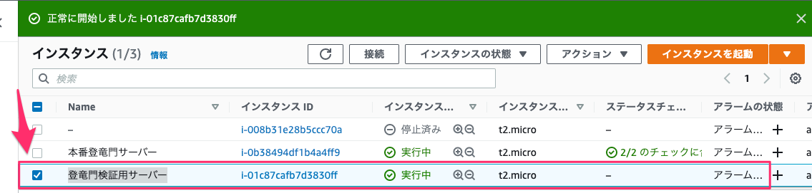

## GOAL

 - 新しい Pem キー 「Ytoryu-key」 で本番サーバーにログイン**できる**ようになっていることを確認
 - 古い Pem キー 「newToryumon.pem」 でログイン**できない**ようになっていることを確認


## [検証] 手順詳細

### 1. 宇内さんが先日検証用に作られた 「登竜門検証用サーバー」 に ”Ytoryu-key.pem” キーを使って SSH ログイン



### 2. `~/.ssh/authorized_keys` ファイルの内容をメモ

```
ssh-rsa AAAAB3NzaC1yc2EAAAADAQABAAABAQCajFKFr7p5t1eN+JeAqBEO2he0oJoW2/DQFb6iqpwUmrP3BMPq3fuTfH4/exG0R9d0GVdr9M/1sU4BKRuvToA8p+5tIcu3DqzLBe+6GEIbpAaZ5J6Fx5Jnb2xDJsTHAK9Hv+u/EXQHZkNHCCVQDzafztJKk/sRo/SiBPRgp5wfqwnveUKFD5adHzu4tbBDZaGZya5Joe9bRHSF+fOlSJISgN3oyhmpZdON/F5aAkBCHhNx/8ZGAaw47DSnVzoIVEarkU3bipVkKhKez1W3uIEqaAOff0VfkmRdA/ACzjee48eOsoDHhZZb3dzikt30XWDnyBBcZ82BmOGx23Oldcnv hometest2
ssh-rsa AAAAB3NzaC1yc2EAAAADAQABAAABAQC7aebD0MyvCmEashwGw64orHWJRI9qkayGnBI62WDNaaCuZLD+jW5t10BOk45JsUlpt03Cns/COzkE9N7j3qGjx25hlhsFtiMxvUvtkL++JX57X6DQRoE9XoLcuGQL0ETK10itJSQge2vv2HR6Y98rh2sNXCiyW32KBQPtKcg8/NsJDrEDWlXvBi5bUK7V7KY5kRQpo09PtVx/uboMwhbDudiKAPak2QPFLNYpJ9P3Tc+J3fWdiG/gwbcx/PrsmFQ4LcHXfPlc+2OpD1RWDPbZ34eby1bacwybhDXMDj561MveZtbtuMDfZn1tQLFb5vrIozR9uTAR1tE8E6iqsZ0j preopening4
ssh-rsa AAAAB3NzaC1yc2EAAAADAQABAAABAQCHfiOToCsHraR9VakiUox493YLbRwi9x3KGeiLcusArcLhqSMpLdQUkDfj7TjxbQPuL/TzObKuPV/MEEau6Hy8UmlD/kHn0qB2d/2yLk4Zr0UZV2PrNQK+hmQPmpiG/BisnBm2Ib5jaU1wztqcbWuulmwMRpYznK7N006SkUCsJWL4/0qMZKMc0g0FgpKNEKVf7zTMuq0Zkl3xmuDmEio4XgmzUpWAutfa+6Dqo/vdfHLGtRM2MH0qHb2Pa5fwBVpyAPeDcppYpjTO8b+VCBeEkMgldwS3ChiUuy9vWMYIuUA3S0lk8+TOvlefQgRMhfDanAOVMSAxMl4odHWM3YEp toryumon
ssh-rsa AAAAB3NzaC1yc2EAAAADAQABAAABAQCXFqtgZ/NwsXuj5AehcT/Sj3v8z6GCqn/QqOv8znuLsGJtnsEh2GYZp4hSNsTsDzfX12+BXSpNg4yjH/7RQvKUGQDpDKA5mOrkbsWQGBtlQAvqx3ELPHyU/MZLQNUdlynTqQgspvRpAfq/A4ESXRmbtHPTk9n7QzndnjOlQA/BTymtcJ34TE1S7s0y2foQG6YPxreZLJ8qvXkSfNNpMQFVPNZaqNTY7pE84zrGjywfSYkw940bFpb/2aRmhMS9wAf7t3i3VbeAhZnJXw2rm4v5rIru/ckEbM0spzcACRULFyQah4iFRvKjaWS6S+IyUx3Hl2oSZTsugo5t4PIi4ESb toryumonOpen
ssh-rsa AAAAB3NzaC1yc2EAAAADAQABAAABAQCR/CzSAsCuCU6rOtyLmr5yA9P8rvrr+J/uxo/yxmV/+E5MwqlbO5GSDnhHcDSk1+t+LmOB7i9+htp88OFxNdSDmGtv6qT80RyjvZDvQJVnBtffCoyhAq0oQ1zpd6YgZh8k25OZEDfMrdO5NFyeN3WxaAPuG7VWgD3D/8lKZvKNCmsmw6I4QSv0kft4m6RHteLAzhSydcF/O4uIA/2XlJAom+9XKyH1ccIc5kwWupX0+L+Ji5YV5U4DeFX+uStYT8lNAD/p4jrPsP19ResnS6KGKQo4Z2J+3MCTzviGDP/6zAQty6n8VE16goAWYdVEV8KfwBmDnyAcZ7cXUKn+5m+P newToryumon
ssh-rsa AAAAB3NzaC1yc2EAAAADAQABAAABAQCbF6IYS7Bp1rq5qHmYbyeZaj0vNZwvqVuF+OD6RlMocKM2b59WdBZT2d6rCmDL9uFgCblIk9uI5mESd4833l0VFpXq5RKOEiCxiAgcpvJCc2Ht8kCHNS8PFWES6qKaKsr01o0Ozla1UaAUUZjfoZvORm9XSyVjol7faYJkHA7O7ukgndtf72sVYZ0hiZ1Mrl+rh7uZQfz5Jf29KYp1QNNhOeABAxXEvrbzWuxVXHJcf7m1rXZJ6WDg0p+2YShWeaWQCj5Fs6I/k6/XJzNZ4Tw4hJpz9Ryr/Lca4VOYUgpA29/9pa4q/Lt6al1ki0sKbnub1iy1vo3IFqi2lxb49iTX Ytoryu-key
```

### 3. 既存pemキー 「newToryumon.pem」 で検証用本番インスタンスにログインできることを確認
確認済み

### 4. `~/.ssh/authorized_keys` フォルダの内容を書き換える

▼ Before
```
ssh-rsa AAAAB3NzaC1yc2EAAAADAQABAAABAQCajFKFr7p5t1eN+JeAqBEO2he0oJoW2/DQFb6iqpwUmrP3BMPq3fuTfH4/exG0R9d0GVdr9M/1sU4BKRuvToA8p+5tIcu3DqzLBe+6GEIbpAaZ5J6Fx5Jnb2xDJsTHAK9Hv+u/EXQHZkNHCCVQDzafztJKk/sRo/SiBPRgp5wfqwnveUKFD5adHzu4tbBDZaGZya5Joe9bRHSF+fOlSJISgN3oyhmpZdON/F5aAkBCHhNx/8ZGAaw47DSnVzoIVEarkU3bipVkKhKez1W3uIEqaAOff0VfkmRdA/ACzjee48eOsoDHhZZb3dzikt30XWDnyBBcZ82BmOGx23Oldcnv hometest2
ssh-rsa AAAAB3NzaC1yc2EAAAADAQABAAABAQC7aebD0MyvCmEashwGw64orHWJRI9qkayGnBI62WDNaaCuZLD+jW5t10BOk45JsUlpt03Cns/COzkE9N7j3qGjx25hlhsFtiMxvUvtkL++JX57X6DQRoE9XoLcuGQL0ETK10itJSQge2vv2HR6Y98rh2sNXCiyW32KBQPtKcg8/NsJDrEDWlXvBi5bUK7V7KY5kRQpo09PtVx/uboMwhbDudiKAPak2QPFLNYpJ9P3Tc+J3fWdiG/gwbcx/PrsmFQ4LcHXfPlc+2OpD1RWDPbZ34eby1bacwybhDXMDj561MveZtbtuMDfZn1tQLFb5vrIozR9uTAR1tE8E6iqsZ0j preopening4
ssh-rsa AAAAB3NzaC1yc2EAAAADAQABAAABAQCHfiOToCsHraR9VakiUox493YLbRwi9x3KGeiLcusArcLhqSMpLdQUkDfj7TjxbQPuL/TzObKuPV/MEEau6Hy8UmlD/kHn0qB2d/2yLk4Zr0UZV2PrNQK+hmQPmpiG/BisnBm2Ib5jaU1wztqcbWuulmwMRpYznK7N006SkUCsJWL4/0qMZKMc0g0FgpKNEKVf7zTMuq0Zkl3xmuDmEio4XgmzUpWAutfa+6Dqo/vdfHLGtRM2MH0qHb2Pa5fwBVpyAPeDcppYpjTO8b+VCBeEkMgldwS3ChiUuy9vWMYIuUA3S0lk8+TOvlefQgRMhfDanAOVMSAxMl4odHWM3YEp toryumon
ssh-rsa AAAAB3NzaC1yc2EAAAADAQABAAABAQCXFqtgZ/NwsXuj5AehcT/Sj3v8z6GCqn/QqOv8znuLsGJtnsEh2GYZp4hSNsTsDzfX12+BXSpNg4yjH/7RQvKUGQDpDKA5mOrkbsWQGBtlQAvqx3ELPHyU/MZLQNUdlynTqQgspvRpAfq/A4ESXRmbtHPTk9n7QzndnjOlQA/BTymtcJ34TE1S7s0y2foQG6YPxreZLJ8qvXkSfNNpMQFVPNZaqNTY7pE84zrGjywfSYkw940bFpb/2aRmhMS9wAf7t3i3VbeAhZnJXw2rm4v5rIru/ckEbM0spzcACRULFyQah4iFRvKjaWS6S+IyUx3Hl2oSZTsugo5t4PIi4ESb toryumonOpen
ssh-rsa AAAAB3NzaC1yc2EAAAADAQABAAABAQCR/CzSAsCuCU6rOtyLmr5yA9P8rvrr+J/uxo/yxmV/+E5MwqlbO5GSDnhHcDSk1+t+LmOB7i9+htp88OFxNdSDmGtv6qT80RyjvZDvQJVnBtffCoyhAq0oQ1zpd6YgZh8k25OZEDfMrdO5NFyeN3WxaAPuG7VWgD3D/8lKZvKNCmsmw6I4QSv0kft4m6RHteLAzhSydcF/O4uIA/2XlJAom+9XKyH1ccIc5kwWupX0+L+Ji5YV5U4DeFX+uStYT8lNAD/p4jrPsP19ResnS6KGKQo4Z2J+3MCTzviGDP/6zAQty6n8VE16goAWYdVEV8KfwBmDnyAcZ7cXUKn+5m+P newToryumon
```

▼ After（ `Ytoryu-key` キーだけにする）
```
ssh-rsa AAAAB3NzaC1yc2EAAAADAQABAAABAQCbF6IYS7Bp1rq5qHmYbyeZaj0vNZwvqVuF+OD6RlMocKM2b59WdBZT2d6rCmDL9uFgCblIk9uI5mESd4833l0VFpXq5RKOEiCxiAgcpvJCc2Ht8kCHNS8PFWES6qKaKsr01o0Ozla1UaAUUZjfoZvORm9XSyVjol7faYJkHA7O7ukgndtf72sVYZ0hiZ1Mrl+rh7uZQfz5Jf29KYp1QNNhOeABAxXEvrbzWuxVXHJcf7m1rXZJ6WDg0p+2YShWeaWQCj5Fs6I/k6/XJzNZ4Tw4hJpz9Ryr/Lca4VOYUgpA29/9pa4q/Lt6al1ki0sKbnub1iy1vo3IFqi2lxb49iTX Ytoryu-key
```


### 5. 新しい Pem キー 「Ytoryu-key」 で、本番サーバー 『本番登竜門サーバー』 にログイン**できる**ようになっていることを確認
WIP

### 6. 古い Pem キー 「newToryumon.pem」 で、本番サーバー 『本番登竜門サーバー』 にログイン**できない**ようになっていることを確認
WIP

### ❏ 参考情報
[【SSH】公開鍵認証とEC2について - Qiita](https://qiita.com/aiandrox/items/98ad9b7551481d890916)

[EC2のキーペア(SSHキー)を交換する方法とは？ | Tech Dive](https://tech-dive.xyz/2020/07/13/ec2%E3%81%AE%E3%82%AD%E3%83%BC%E3%83%9A%E3%82%A2ssh%E3%82%AD%E3%83%BC%E3%82%92%E4%BA%A4%E6%8F%9B%E3%81%99%E3%82%8B%E6%96%B9%E6%B3%95%E3%81%A8%E3%81%AF%EF%BC%9F/#toc2)